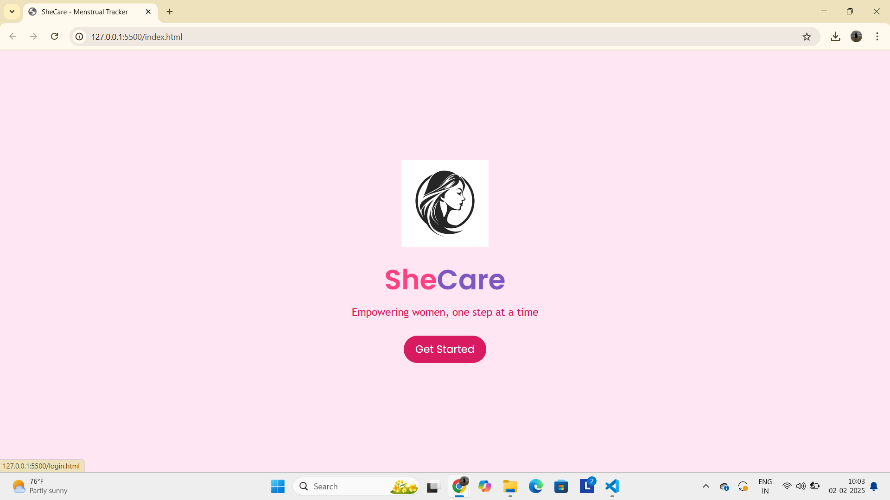
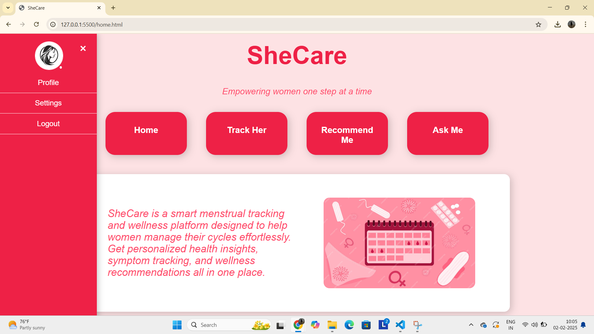

# SheCare – Complete Women's Wellness Hub 🎯

## Basic Details
### Team Name: -1000Aura

### Team Members
- Member 1:  Ann Rose Thomson   - Sahrdaya College of Engineering and Technology
- Member 2:  Ashifa M S         - Sahrdaya College of Engineering and Technology
- Member 2:  Anjana Varghese    - Sahrdaya College of Engineering and Technology

### Project Description
Our aim with **SheCare** is to create an all-in-one wellness platform that empowers women to take control of their health. We strive to provide personalized menstrual cycle tracking, relevant product recommendations, and a supportive AI chatbot, helping women better understand and manage their menstrual well-being.

### The Problem statement
Let’s be real—menstrual health is already so easy to manage, right? I mean, who doesn’t love juggling a dozen apps just to track a cycle, hunt for random product recommendations, and pretend that an AI chatbot actually gets it? It’s not like women deserve a simple, unified solution that actually gets their needs. Why not keep everything scattered and confusing? 
Oh wait, that’s exactly why SheCare was created. Because we thought, "Hey, how about we throw all that nonsense out the window and build something that actually makes sense?" A platform that tracks cycles, recommends products like we’re reading your mind, and even provides a chatbot that isn’t just there to annoy you with useless info. You’re welcome. 🙄✨

### The Solution 
Introducing "SheCare: The Menstrual Mastermind"!
 SheCare will:

- Track your menstrual cycle like a psychic 🧙‍♀️. 
- Suggest products that somehow know exactly what you need (because we’ve got magic powers). 🔮 
- Chat with you in a way that makes you feel like you’re talking to a friend who actually cares. (Not just an AI pretending.) 💬
   
## Technical Details/Components Used
For Software:
- Languages used   :-  HTML, CSS, and JavaScript 
- Tools used       :-  Firebase (BaaS) platform

### Implementation
For Software:
# Installation
none
# Run
none

### Project Documentation
For Software:   SheCare is an all-in-one platform that simplifies menstrual health by offering cycle tracking, personalized product recommendations, and an AI-powered chatbot, all in one place.

# Screenshots (Add at least 3)

the beginning page we are landed on.

Includes a dashboard which has profile pic,saved details,settings and logout.Mainly it has 4 buttons :-home,recommend me,track her and ask me which on clicking gets redirected to their respective pages

  

# Diagrams

# Video[
(https://drive.google.com/file/d/1XwN-FafpUY9Q33RgKiNf7_KqSeVl-ArN/view?usp=drivesdk)

# Team Contributions
Ann Rose Thomson  -   Frontend Developer (HTML & CSS)
 Ashifa M S  - Frontend Developer (HTML)& handled javascript part 
Anjana Varghese - AI Integration & Backend Developer (JavaScript/Firebase)

Shared Responsibilities   : Collaboration,Testing and Documentation
